```{r setup, include=FALSE}
options(htmltools.dir.version = FALSE)
knitr::opts_chunk$set(
  fig.width=9, fig.height=3.5, fig.retina=3,
  out.width = "100%",
  cache = FALSE,
  echo = FALSE,
  message = FALSE, 
  warning = FALSE,
  fig.show = TRUE,
  hiline = TRUE
)
```

```{r xaringan-themer, include=FALSE, warning=FALSE}
library(xaringanthemer)
style_duo_accent(
  primary_color = "#D2202B",
  secondary_color = "#D2202B",
  inverse_header_color = "#FFFFFF",
  link_color = "#676C72",
    header_font_google = google_font("Josefin Sans")

)
```

class: hide_logo, title-slide, bottom
background-image: url(`r rmarkdown::metadata$url_unsplash`)
background-size: cover

# `r rmarkdown::metadata$title`

## `r rmarkdown::metadata$subtitle`

### `r rmarkdown::metadata$author` - `r rmarkdown::metadata$team`

### `r rmarkdown::metadata$coauthors`

### `r rmarkdown::metadata$date`

<p xmlns:cc="http://creativecommons.org/ns#" xmlns:dct="http://purl.org/dc/terms/">Les slides de présentation par Nicolas Bressoud sont soumises à une licence <a href="http://creativecommons.org/licenses/by-nc/4.0/?ref=chooser-v1" target="_blank" rel="license noopener noreferrer" style="display:inline-block;">CC BY-NC 4.0</a></p>

---
class: middle left


```{r xaringan-logo, echo=FALSE}
xaringanExtra::use_logo(
  image_url = "img/hep.png")
```

```{r xaringan-progress-bar, echo=FALSE}
xaringanExtra::use_progress_bar(color = "#D2202B", location = "top", height = "12px")

```

.pull-left[

### Structure

1. Contexte

1. Zoom sur **les forces de caractère**

1. Matériel pédagogique

1. Premières données

1. Perspectives

1. Divers

]

.pull-right[

```{r out.width = '90%', echo=FALSE}
# local
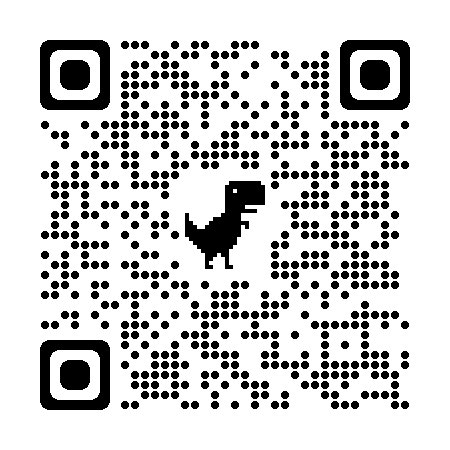
```

]
---
class: title-slide, inverse
background-image: url("https://images.unsplash.com/photo-1469474968028-56623f02e42e?ixlib=rb-1.2.1&ixid=MnwxMjA3fDB8MHxwaG90by1wYWdlfHx8fGVufDB8fHx8&auto=format&fit=crop&w=2948&q=80")
background-size: cover

# Contexte

---
class: left

# Contexte

--
### Enseigner en classe hétérogène

- Prise en compte des différences [(déclaration de la CIIP, janvier 2003)](https://www.ciip.ch/La-CIIP/Documents-officiels/Declarations-politiques)
- Compensation des désavantages [(csps.ch)](https://www.csps.ch/themes/compensation-des-desavantages)
- Politiques intégratives [(concordat, cdip.ch)](https://www.edk.ch/fr/themes/pedagogie-specialisee)
- Recommandations pour les formations [(swissuniversities.ch)](https://www.swissuniversities.ch/fileadmin/swissuniversities/Dokumente/Kammern/Kammer_PH/Empf/20160914_20161027_AP_Chambre_HEP_Recommandations_pédagogie_spécialisée_fr.pdf)

--

### Thème prometteur

- Forces de caractère [(Peterson & Seligman, 2004)](https://psycnet.apa.org/record/2004-13277-000)
- Utilisation des forces (identifier, utiliser, promouvoir) [(Linkins et al., 2015)](https://www.tandfonline.com/doi/abs/10.1080/17439760.2014.888581)

--

### Impact relevé / potentiel

- Bénéfices pour les relations dans la classe [(Quinlan et al., 2014)](https://www.tandfonline.com/doi/abs/10.1080/17439760.2014.920407)
- Impact sur les affects positifs, le bien-être, la satisfaction de vie [(Schutte & Malouff, 2018)](https://link.springer.com/article/10.1007/s10902-018-9990-2)

---
class: left

### Prise de recul sur le fonctionnement possible

.center[
```{r out.width = '45%', echo=FALSE}
# local
knitr::include_graphics("img/bressoud_gay_2022.jpg")
```

[(Bressoud & Gay, 2022)](https://szh-shop.faros.ch/cms/Artikel-Detail/67565?itemID=REV2022_03)

]

---

class: title-slide, inverse
background-image: url("https://images.unsplash.com/photo-1471286174890-9c112ffca5b4?ixlib=rb-1.2.1&ixid=MnwxMjA3fDB8MHxwaG90by1wYWdlfHx8fGVufDB8fHx8&auto=format&fit=crop&w=2338&q=80")
background-size: cover

# Zoom sur les forces de caractère

---
class: middle center

# Zoom sur les forces de caractère

--

*« Une force est une capacité préexistante pour une façon particulière de se comporter, de penser, ou de ressentir qui est authentique et énergisante pour l’utilisateur et qui permet un fonctionnement optimal, un développement et une performance. »*

[Linley (2008)](https://www.amazon.fr/Average-Realising-Strengths-Yourself-Others/dp/1906366039)

---
class: left

# Zoom sur les forces de caractère

--

.pull-left[
Une pédagogie en 5 étapes pour faire émerger et utiliser des **ressources personnelles** au sein du groupe [(Linkins et al., 2015)](https://www.tandfonline.com/doi/abs/10.1080/17439760.2014.888581) :

1. Connaître le vocabulaire des forces

1. Identifier les forces des autres

1. Identifier ses propres forces

1. Utiliser ses propres forces dans de nouveaux contextes

1. Identifier et célébrer les forces du groupe

]

.pull-right[

```{r out.width = '90%', echo=FALSE}
# local
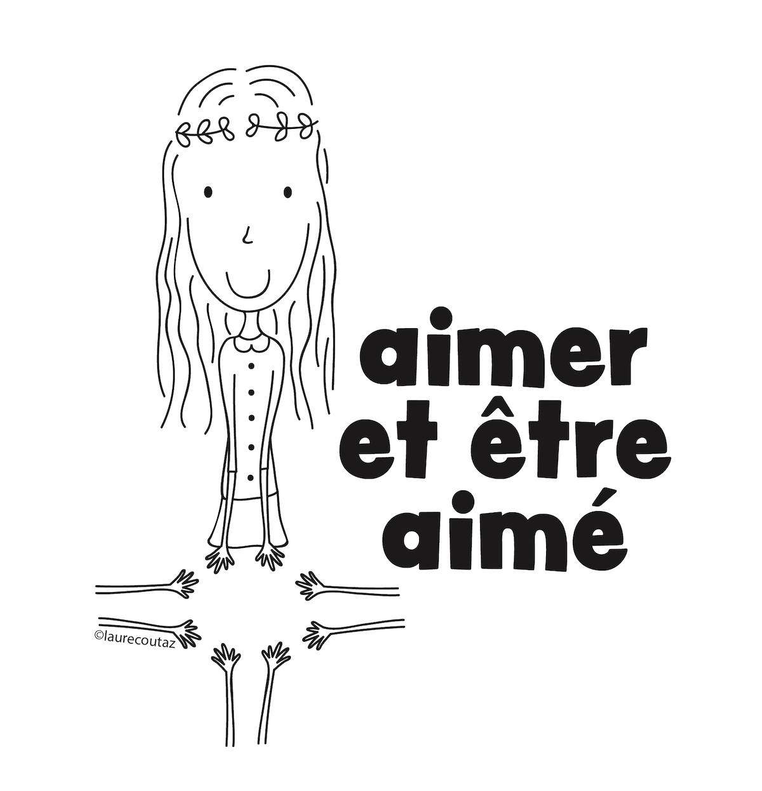
```

]

---
class: left

# Zoom sur les forces de caractère

.pull-left[
Une pédagogie en 5 étapes pour faire émerger et utiliser des **ressources personnelles** au sein du groupe [(Linkins et al., 2015)](https://www.tandfonline.com/doi/abs/10.1080/17439760.2014.888581) :

1. Connaître le vocabulaire des forces

1. Identifier les forces des autres

1. Identifier ses propres forces

1. Utiliser ses propres forces dans de nouveaux contextes

1. Identifier et célébrer les forces du groupe

]

.pull-right[

```{r out.width = '80%', echo=FALSE}
# local
knitr::include_graphics("img/2.jpg")
```

]

---
class: left

# Zoom sur les forces de caractère

.pull-left[
Une pédagogie en 5 étapes pour faire émerger et utiliser des **ressources personnelles** au sein du groupe [(Linkins et al., 2015)](https://www.tandfonline.com/doi/abs/10.1080/17439760.2014.888581) :

1. Connaître le vocabulaire des forces

1. Identifier les forces des autres

1. Identifier ses propres forces

1. Utiliser ses propres forces dans de nouveaux contextes

1. Identifier et célébrer les forces du groupe

]

.pull-right[

```{r out.width = '70%', echo=FALSE}
# local
knitr::include_graphics("img/3.jpg")
```

]

---
class: left

# Zoom sur les forces de caractère

.pull-left[
Une pédagogie en 5 étapes pour faire émerger et utiliser des **ressources personnelles** au sein du groupe [(Linkins et al., 2015)](https://www.tandfonline.com/doi/abs/10.1080/17439760.2014.888581) :

1. Connaître le vocabulaire des forces

1. Identifier les forces des autres

1. Identifier ses propres forces

1. Utiliser ses propres forces dans de nouveaux contextes

1. Identifier et célébrer les forces du groupe

]

.pull-right[

```{r out.width = '70%', echo=FALSE}
# local
knitr::include_graphics("img/4.jpg")
```

]

---
class: left

# Zoom sur les forces de caractère

.pull-left[
Une pédagogie en 5 étapes pour faire émerger et utiliser des **ressources personnelles** au sein du groupe [(Linkins et al., 2015)](https://www.tandfonline.com/doi/abs/10.1080/17439760.2014.888581) :

1. Connaître le vocabulaire des forces

1. Identifier les forces des autres

1. Identifier ses propres forces

1. Utiliser ses propres forces dans de nouveaux contextes

1. Identifier et célébrer les forces du groupe

]

.pull-right[

```{r out.width = '100%', echo=FALSE}
# local
knitr::include_graphics("img/5.jpg")
```

]

---
class: left

# Zoom sur les forces de caractère

.pull-left[
Une pédagogie en 5 étapes pour faire émerger et utiliser des **ressources personnelles** au sein du groupe [(Linkins et al., 2015)](https://www.tandfonline.com/doi/abs/10.1080/17439760.2014.888581) :

1. Connaître le vocabulaire des forces

1. Identifier les forces des autres

1. Identifier ses propres forces

1. Utiliser ses propres forces dans de nouveaux contextes

1. Identifier et célébrer les forces du groupe

]

.pull-right[

```{r out.width = '70%', echo=FALSE}
# local
knitr::include_graphics("img/6.jpg")
```

]

---
class: left

# Différents modèles de "forces"

--

.center[

```{r out.width = '90%', echo=FALSE}
# local
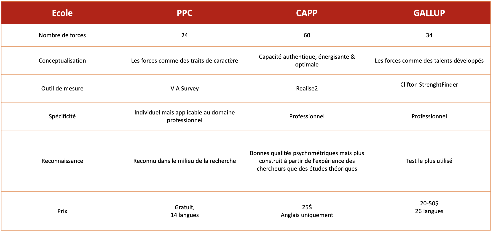
```

]

D'après Joran Farnier (2018)

---
class: left

# Le modèle du VIA Institute

--
.center[

```{r out.width = '80%', echo=FALSE}
# local
knitr::include_graphics("img/11.png")
```

]
---
class: title-slide, inverse
background-image: url("https://images.unsplash.com/photo-1623503664086-475867ec20b3?ixlib=rb-1.2.1&ixid=MnwxMjA3fDB8MHxwaG90by1wYWdlfHx8fGVufDB8fHx8&auto=format&fit=crop&w=3173&q=80")
background-size: cover

# Matériel pédagogique

---
class: center middle

```{r out.width = '40%', echo=FALSE}
# local
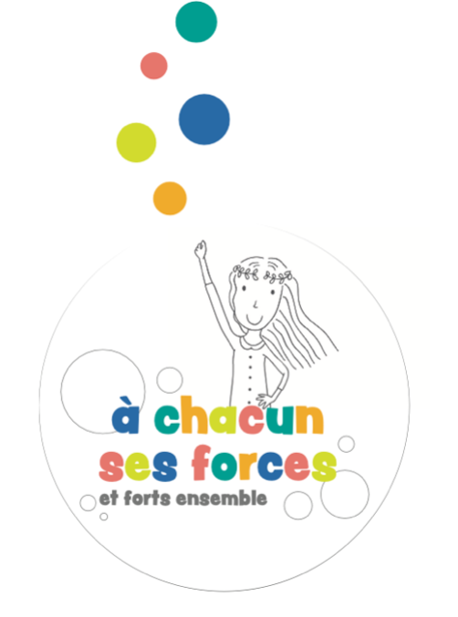
```


---
class: middle center

# A chacun ses forces et forts ensemble

--

Accompagner la vie scolaire

Proposer des activité PER-compatibles

Faciliter l’utilisation (temps, matière, moment)

Protéger le « principe actif »

---
class: left

# A chacun ses forces et forts ensemble

.pull-left[

Un boîte d’activités contient :
- 1 poster parcours de 20 cases

- 1 poster des 24 forces

- 30 cartes défis

- 24 cartes des forces

- 1 dossier de matériel complémentaire

- 1 guide de l’enseignant·e
]

.pull-right[

```{r out.width = '70%', echo=FALSE}
# local

```

]


---
class: left

# A chacun ses forces et forts ensemble

.pull-left[

Un boîte d’activités contient :
- 1 poster parcours de 20 cases

- 1 poster des 24 forces

- 30 cartes défis

- 24 cartes des forces

- 1 dossier de matériel complémentaire

- 1 guide de l’enseignant·e
]

.pull-right[

```{r out.width = '100%', echo=FALSE}
# local
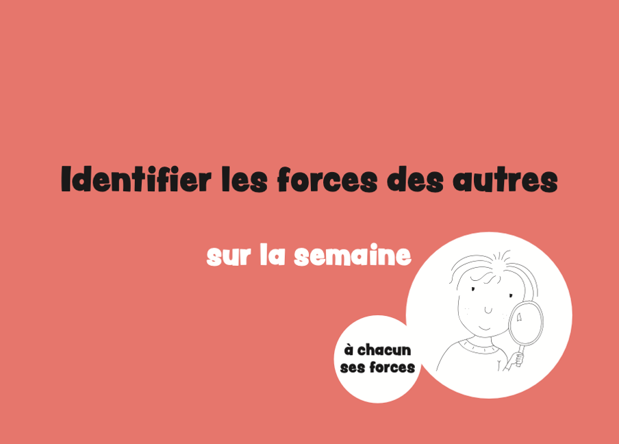
```

]


---
class: left

# A chacun ses forces et forts ensemble

.pull-left[

Un boîte d’activités contient :
- 1 poster parcours de 20 cases

- 1 poster des 24 forces

- 30 cartes défis

- 24 cartes des forces

- 1 dossier de matériel complémentaire

- 1 guide de l’enseignant·e
]

.pull-right[

```{r out.width = '100%', echo=FALSE}
# local
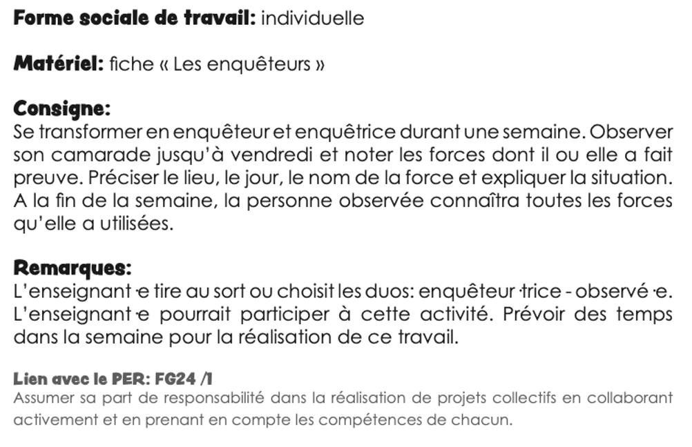
```

]


---
class: left

# A chacun ses forces et forts ensemble

.pull-left[

Un boîte d’activités contient :
- 1 poster parcours de 20 cases

- 1 poster des 24 forces

- 30 cartes défis

- 24 cartes des forces

- 1 dossier de matériel complémentaire

- 1 guide de l’enseignant·e
]

.pull-right[

```{r out.width = '100%', echo=FALSE}
# local
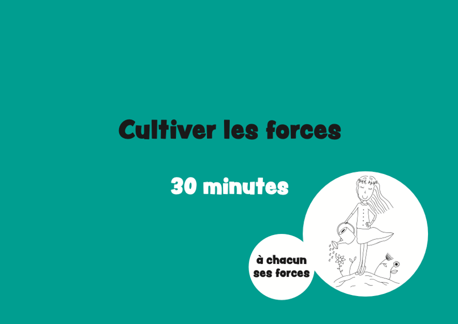
```

]


---
class: left

# A chacun ses forces et forts ensemble

.pull-left[

Un boîte d’activités contient :
- 1 poster parcours de 20 cases

- 1 poster des 24 forces

- 30 cartes défis

- 24 cartes des forces

- 1 dossier de matériel complémentaire

- 1 guide de l’enseignant·e
]

.pull-right[

```{r out.width = '100%', echo=FALSE}
# local
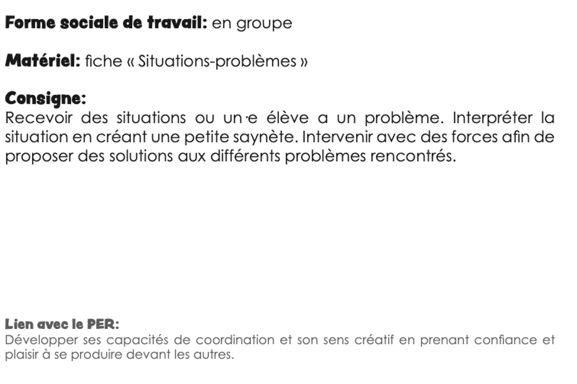
```

]

---
class: title-slide, inverse
background-image: url("https://images.unsplash.com/photo-1555949963-ff9fe0c870eb?ixlib=rb-1.2.1&ixid=MnwxMjA3fDB8MHxwaG90by1wYWdlfHx8fGVufDB8fHx8&auto=format&fit=crop&w=2940&q=80")
background-size: cover

# Premières expérimentations 

---
class: left

# Premières expérimentations 

--

- 3 classes valaisannes
- 3 séances par semaine
- 5 semaines

```{r out.width = '100%', echo=FALSE}
# local
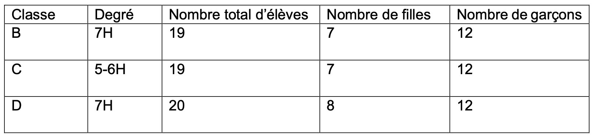
```

Selon les travaux de L. Mascolo et A. Blot (HEP-VS, 2020)

---
class: left

# Premières expérimentations - élèves


```{r out.width = '90%', echo=FALSE}
# local
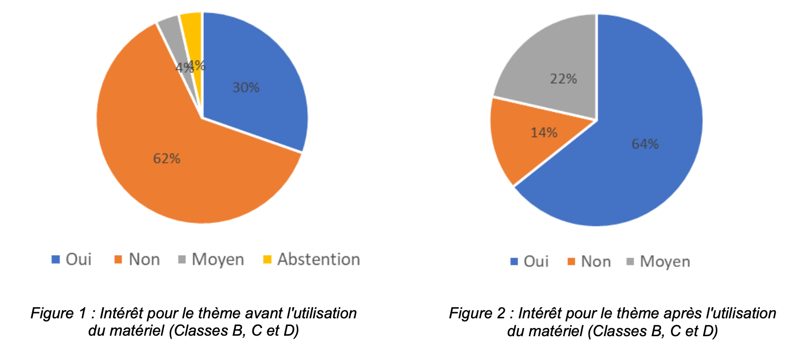
```

Selon les travaux de L. Mascolo et A. Blot (HEP-VS, 2020)

---
class: left

# Premières expérimentations - élèves

.center[

```{r out.width = '90%', echo=FALSE}
# local
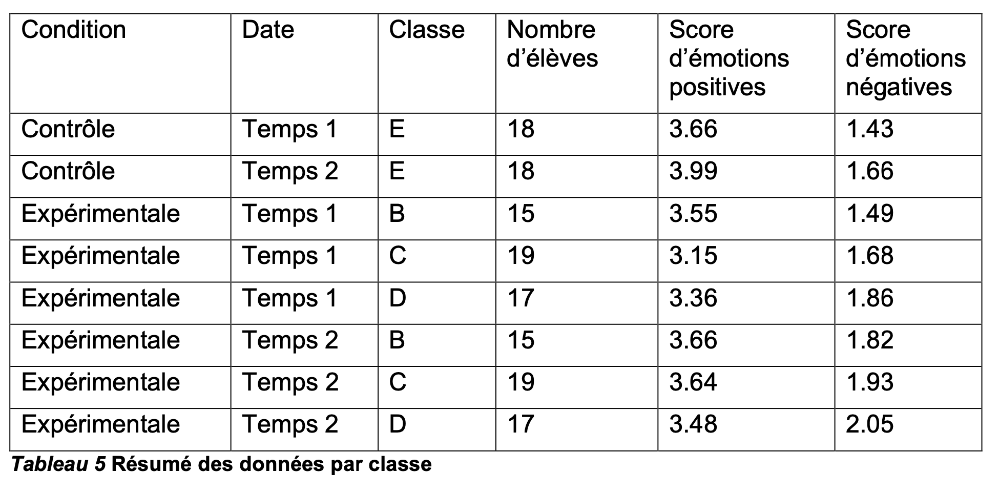
```

]

Selon les travaux de L. Mascolo et A. Blot (HEP-VS, 2020)

---
class: left

# Premières expérimentations - élèves

.pull-left[

```{r out.width = '100%', echo=FALSE}
# local
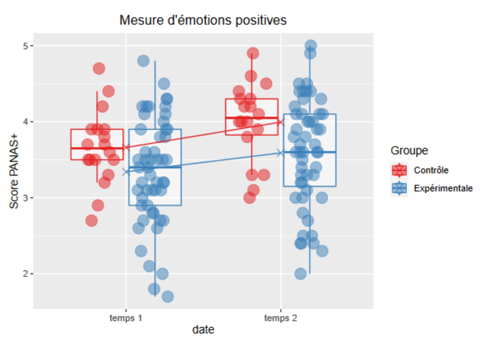
```

]

.pull-right[

```{r out.width = '100%', echo=FALSE}
# local
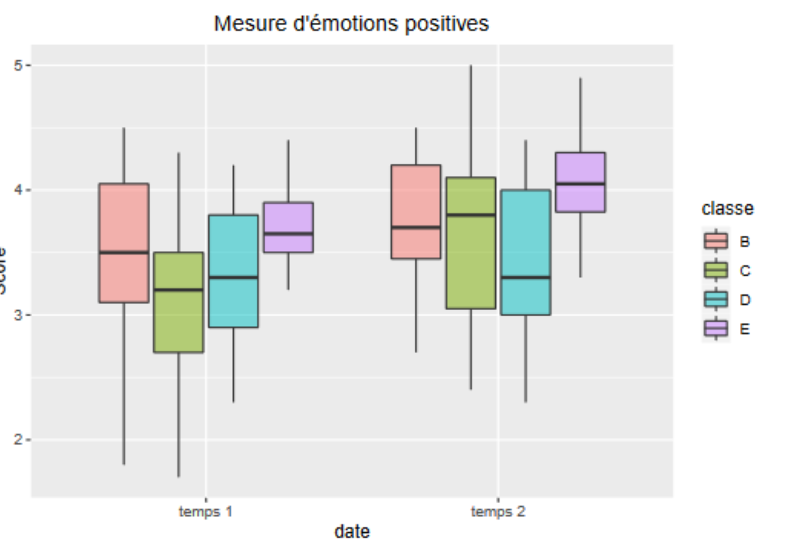
```

]

Selon les travaux de L. Mascolo et A. Blot (HEP-VS, 2020)

---
class: left

# Premières expérimentations - élèves

.pull-left[
```{r out.width = '100%', echo=FALSE}
# local
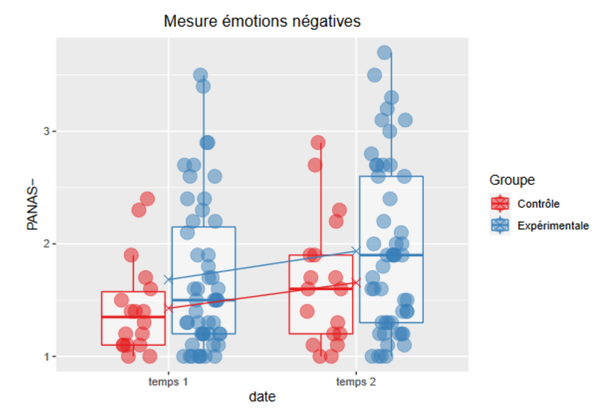
```

]

.pull-right[

```{r out.width = '100%', echo=FALSE}
# local
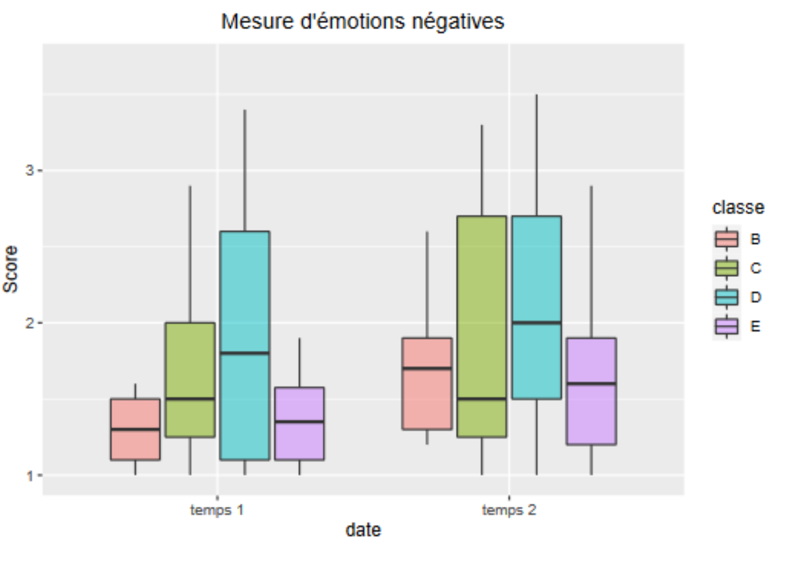
```

]
---
class: left

# Premières expérimentations - profs

- Clarté de la ligne pédagogique

- Côté pratique du matériel

- Connexion avec le PER 

- **Sensation** d'un apprentissage chez les élèves

- Améliorations possibles : taille du poster, formulation des consignes, durée des activités

Selon les travaux de L. Mascolo et A. Blot (HEP-VS, 2020)

---
class: left middle

# Premières expérimentations - Le gap

--

## Qu'apprennent les élèves ?

---
class: title-slide, inverse
background-image: url("https://images.unsplash.com/photo-1581574919402-5b7d733224d6?ixlib=rb-1.2.1&ixid=MnwxMjA3fDB8MHxwaG90by1wYWdlfHx8fGVufDB8fHx8&auto=format&fit=crop&w=2940&q=80")
background-size: cover

# Perspectives

---
class: left

# Perspectives

--

## Ce qu'il reste à faire

--
.pull-left[

## Partie 1

### Variable dépendante

- Strengths use scale [(Govindji & Linley, 2007)](https://psycnet.apa.org/record/2007-19806-004)

### Variables indépendantes

- Temps
- Groupe

]

--

.pull-left[

## Partie 2

### Variables dépendantes

- Orientation reconnaissante
- Bonheur subjectif
- Qualité des relations entre pairs

### Variable indépendante 

- Strengths use scale [(Govindji & Linley, 2007)](https://psycnet.apa.org/record/2007-19806-004)

]

---
class: left


# Perspectives

## Ce qu'il reste à faire

--

### Matériel

- Groupe expérimental :

    - Utilisation du matériel pédagogique par les enseignant·es (10 x 30 min)
    - 2 sessions par semaine sur 5 semaines
    - Coaching par l'expérimentateur (1 fois avant et 2 fois pendant la procédure)

- Mesures avant et après intervention dans les groupes contrôle et expérimental

--

### Aspects éthiques

- Approbation par une commission d'éthique
- Anonymisation
- Approbation par le SE de l'Etat du Valais

---
class: title-slide, inverse
background-image: url("https://images.unsplash.com/photo-1520004434532-668416a08753?ixlib=rb-1.2.1&ixid=MnwxMjA3fDB8MHxwaG90by1wYWdlfHx8fGVufDB8fHx8&auto=format&fit=crop&w=2940&q=80")
background-size: cover


# Perspectives

## Résultats attendus

---
class: left

# Perspectives

## Résultats attendus
Une analyse multiniveaux pourrait indiquer :

- une progression de l'utilisation des forces dans le groupe expérimental sur le temps comparativement au groupe contrôle.

Une analyse corrélationnelle pourrait indiquer :

- une prédiction de l'orientation reconnaissante, du bonheur subjectif, de la qualité des relations entre pairs par l'utilisation des forces.


---
class: title-slide, inverse
background-image: url("https://images.unsplash.com/photo-1518623001395-125242310d0c?ixlib=rb-1.2.1&ixid=MnwxMjA3fDB8MHxwaG90by1wYWdlfHx8fGVufDB8fHx8&auto=format&fit=crop&w=2880&q=80")
background-size: cover

# Divers 

---
class: title-slide, inverse
background-image: url("https://images.unsplash.com/photo-1633613286848-e6f43bbafb8d?ixlib=rb-1.2.1&ixid=MnwxMjA3fDB8MHxwaG90by1wYWdlfHx8fGVufDB8fHx8&auto=format&fit=crop&w=2940&q=80")
background-size: cover

# Questions ouvertes

---
class: left

# Questions ouvertes

- Est-ce que la théorie de l'autodétermination consolide à satisfaction le projet ?

- Quelles théories adjacentes peuvent permettre de comprendre les enjeux ?

- Quelles autres mesures validées et normées peuvent être prises en compte ?

- Quelles pistes dans l'implémentation pédagogique peuvent être explorées ?

---

class: middle

.left[


## &#x1F64F; Merci !

]

--

.right[


Crédits Photo par ordre d'apparition :

[Laure Coutaz Bressoud](https://thecloudyfactory.ch)

[David Marcu](https://unsplash.com/photos/78A265wPiO4)

[Ben White](https://unsplash.com/photos/lVCHfXn3VME)

[Mats Hagwall](https://unsplash.com/photos/uzl47XdoLww)

[Kelly Sikkema](https://unsplash.com/photos/4JxV3Gs42Ks)

[Engin Akyurt](https://unsplash.com/photos/bPiuY2ZSlvU)

[Shahadat Rahman](https://unsplash.com/photos/BfrQnKBulYQ)

[Vidar Nordli-Mathisen](https://unsplash.com/photos/Kuu5mmxkwW4)

[Towfiqu barbhuiya](https://unsplash.com/photos/oZuBNC-6E2s)

]
